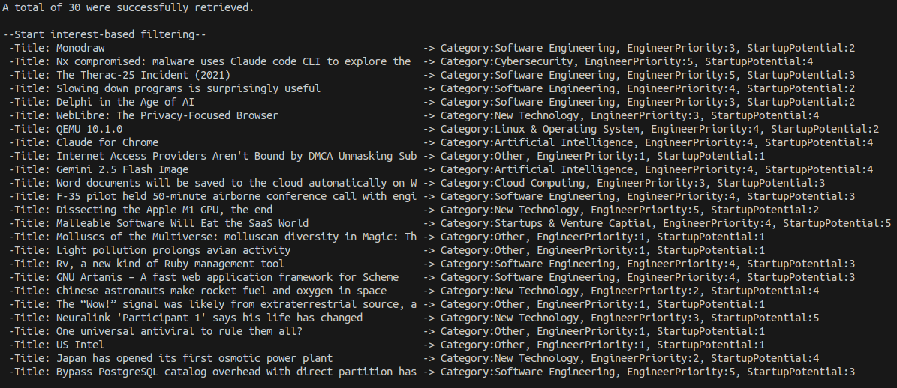
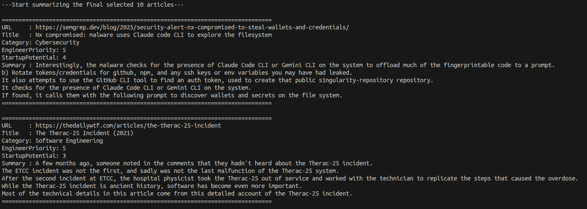

# Summarize Hacker News article!
| !It's under development.

## Overview
This AI-based content curation script automatically collects, analyzes and summarize popular articles from Hacker News, provideing key technology trends tailored to your interested.

Beyond simply scraping articles, we leverage Google Gemini AI to categorize each article and score its importance from a developer and startup perspective. Based on these scores, we intelligently select the 10 most valuable articles, then generate a final summary using Selenium and newspaper3k.

## Guidelines

    git clone <project>

    # use 'pip'
    pip install -r requirements.txt
    # use 'uv'
    uv sync

- Obtain a gemini API key - https://ai.google.dev/gemini-api/docs
- Register the issued API KEY in the environment variable. It must be set to "GOOGLE_API_KEY" or "GEMINI_API_KEY".
- Once everything is done, just run main.py.

## Execution Flow
1. Article collection and pre-filtering
- **get_hacker_news_urls()** function calls the Hacker News API to retrieve the titles and URLs of the top 30 articles.
- **is_supported_url()** function immediately removes articles from the list that have domains that are meaningless to analyze, such as GitHub or X.com.

2. AI analysis and primary filtering
- Pass a list of pre-filtered article titles to the **get_article_category()** function in config_gemini.py.
- Gemini AI analyzes each title, classifies it into one of the predefined **INTEREST_CATEGORIES**, and returns the results with EngineerPriority and StartupPotential scores.
- Based on these results, we add category and score information to each article object and filter out articles that do not belong to **INTEREST_CATEGORIES**.

3. Final selection based on priority
- Sorting is performed on articles that pass the first filtering.
- The sorting criteria are EngineerPriority score, and if scores are the same, StartupPotential score.
- Select the top 10 articles with the highest scores.

4. Crawling, summarizing, and outputting results
- Iterate over the list of 10 articles selected and call **crawl_and_summarize()** function.
- Each function runs a Selenium web driver to access the URL, and once the page is fully loaded, it extracts the article body and summarizes it using newspaper3k.
- Finally, it outputs the URL, title, AI-analyzed category, priority score, and final summary for each article.

## Dependecies
    requests
    nltk
    selenium
    webdriver-manager
    newspaper3k
    google-genai
    lxml[html_clean]

## Output Example

